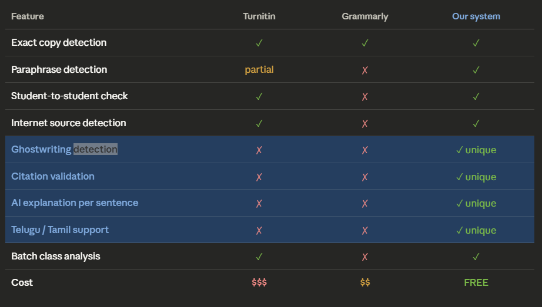

# AI Plag Checker

### Smart AI-powered plagiarism detection for text originality and similarity analysis

---

## Introduction

**AI Plag Checker** is an intelligent plagiarism detection project that helps users verify text originality and identify similarity in content using AI-based analysis. It is built to analyze textual content and detect possible plagiarism by comparing text similarity patterns. The project uses AI and natural language processing concepts to help users check whether a piece of content is original or potentially copied. It is useful for students, educators, writers, and researchers who want a simple and effective way to validate content authenticity.

### Keywords
- AI
- Plagiarism Detection
- Text Analysis
- Natural Language Processing
- Content Similarity
- Originality Checker
- Machine Learning

---

## Project Workflow



---

## Demo Video

Add your project demo link here.

Example:

[Project Demo Video](https://your-demo-link-here.com)

---

## User Instructions

### Installation

Clone the repository:

```bash
git clone https://github.com/RajeshBenarjee/AI_Plag_Checker.git